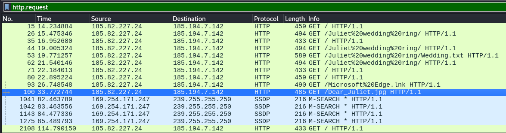
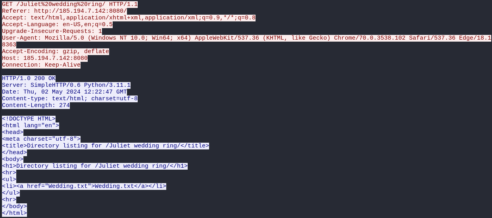
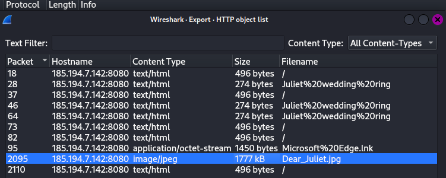
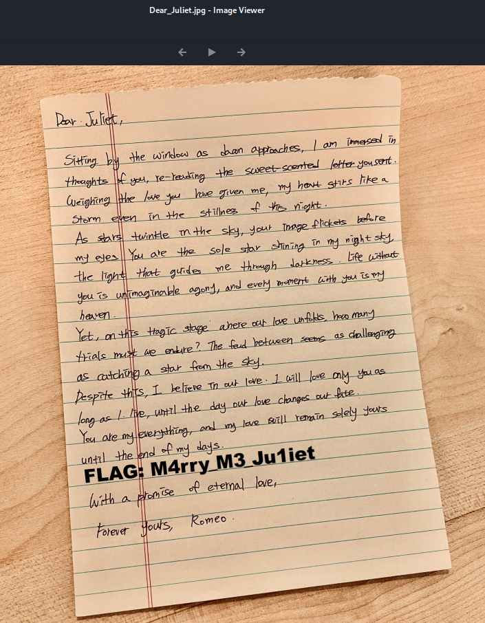

# Romeo and Juliet

Let's inspect the PCAP file's HTTP requests before moving on to SMTP.

​​

From this, we can see an image **Dear_Juliet.jpg**. Let's follow the HTTP stream for  **/Juliet wedding ring** as well.

​​

Looks like a directory listing page (Apache?) containing a link to the file **wedding.txt**. Hence, let's export all objects, specifically **Dear_Juliet.jpg** and **wedding.txt**.

​​

​​

Flag: CDDC2024{M4rry_M3_Ju1iet}
