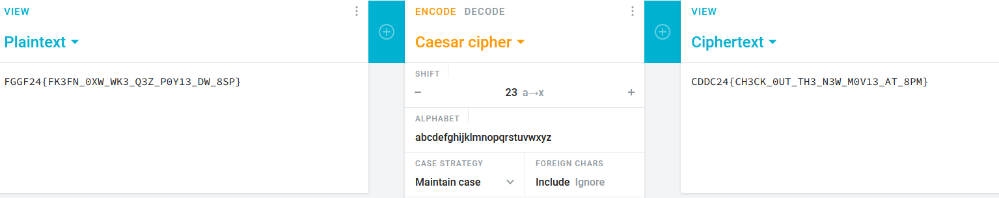

# Simple1

Get the plaintext of "FGGF24{FK3FN_0XW_WK3_Q3Z_P0Y13_DW_8SP}"

As shown below, it's just a simple **caesar cipher**.

​​

Flag: CDDC24{CH3CK_0UT_TH3_N3W_M0V13_AT_8PM}

## References

https://cryptii.com/pipes/caesar-cipher
