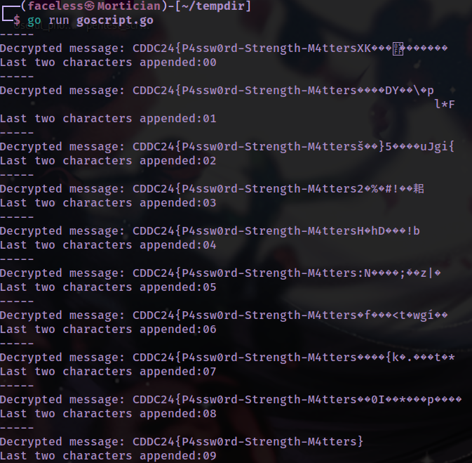

# Simple2

The encrypted string via AES only has 126 bits and is missing it's **last two bits** (I'm assuming it's the last two and not first two, etc.)

Hence, we just have to edit the go script to brute force the last two bits. Remember to brute force only hexadecimal characters since AES encrypted string characters are all hexadecimal!

```
package main

import (
	"crypto/aes"
	"crypto/cipher"
	"encoding/hex"
	"fmt"
	"log"
)

func main() {
	encryptedData := "6f7e9007dd0882f3f320a08690a230b84fcfa66b483dc4f4352123276622af4cc5c656bf0171c36271700f8f4f0f41d14d7c20baec601c70f670acc8b6037a"
	keyString := "6eba99bf3fac4c92a857b05cff433a39"
	//var characters = [36]string{"0", "1", "2", "3", "4", "5", "6", "7", "8", "9", "a", "b", "c", "d", "e", "f", "g", "h", "i", "j", "k", "l", "m", "n", "o", "p", "q", "r", "s", "t", "u", "v", "w", "x", "y", "z"}
	var characters = [16]string{"0", "1", "2", "3", "4", "5", "6", "7", "8", "9", "a", "b", "c", "d", "e", "f"}
	for true {
		for i := 0; i < len(characters); i++ {
			for j :=0; j<len(characters); j++ {
				newData := encryptedData + characters[i] + characters[j]
				//fmt.Printf(newData)
				key, err := hex.DecodeString(keyString)
				if err != nil {
					log.Fatal(err)
				}
				ciphertext, err := hex.DecodeString(newData)
				if err != nil {
					log.Fatal(err)
				}
				block, err := aes.NewCipher(key)
				if err != nil {
					log.Fatal(err)
				}
				if len(ciphertext)%aes.BlockSize != 0 {
					log.Fatal("The length of the encrypted data is incorrect")
				}
				iv := ciphertext[:aes.BlockSize]
				ciphertext = ciphertext[aes.BlockSize:]

				mode := cipher.NewCBCDecrypter(block, iv)
				mode.CryptBlocks(ciphertext, ciphertext)
				fmt.Println("-----")
				fmt.Printf("Decrypted message: %s\n", string(ciphertext))
				fmt.Println("Last two characters appended:" + characters[i] + characters[j])
		
			}
		}
	}
}
```

​​

Flag: CDDC24{P4ssw0rd-Strength-M4tters}

‍

## References

ChatGPT

https://gophercoding.com/while-true-loop/

https://www.educative.io/answers/how-to-get-the-length-of-an-array-in-golang

https://www.geeksforgeeks.org/different-ways-to-concatenate-two-strings-in-golang/

Original script I edited (simple2.go)

```
package main

import (
	"crypto/aes"
	"crypto/cipher"
	"encoding/hex"
	"fmt"
	"log"
)

func main() {

	encryptedData := "6f7e9007dd0882f3f320a08690a230b84fcfa66b483dc4f4352123276622af4cc5c656bf0171c36271700f8f4f0f41d14d7c20baec601c70f670acc8b6037a"
	keyString := "6eba99bf3fac4c92a857b05cff433a39"

	key, err := hex.DecodeString(keyString)
	if err != nil {
		log.Fatal(err)
	}
	ciphertext, err := hex.DecodeString(encryptedData)
	if err != nil {
		log.Fatal(err)
	}

	block, err := aes.NewCipher(key)
	if err != nil {
		log.Fatal(err)
	}
	if len(ciphertext)%aes.BlockSize != 0 {
		log.Fatal("The length of the encrypted data is incorrect")
	}

	iv := ciphertext[:aes.BlockSize]
	ciphertext = ciphertext[aes.BlockSize:]

	mode := cipher.NewCBCDecrypter(block, iv)
	mode.CryptBlocks(ciphertext, ciphertext)

	padding := int(ciphertext[len(ciphertext)-1])
	if padding < 1 || padding > aes.BlockSize {
		log.Fatal("This is incorrect padding.")
	}
	for _, val := range ciphertext[len(ciphertext)-padding:] {
		if int(val) != padding {
			log.Fatal("This is incorrect padding.")
		}
	}
	ciphertext = ciphertext[:len(ciphertext)-padding]
	fmt.Printf("Decrypted message: %s\n", string(ciphertext))
}
```

‍
