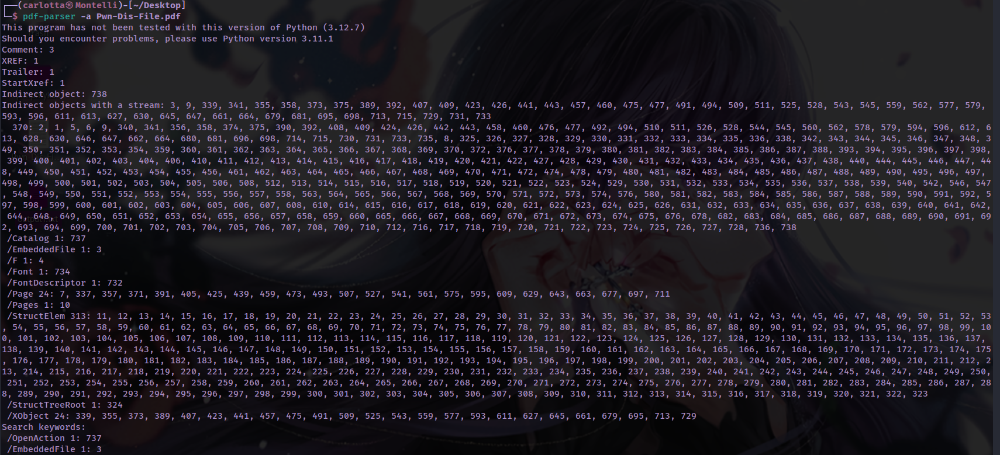
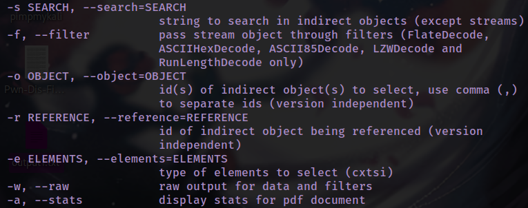
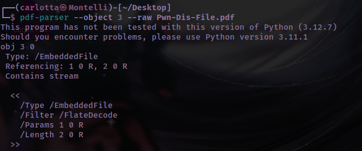
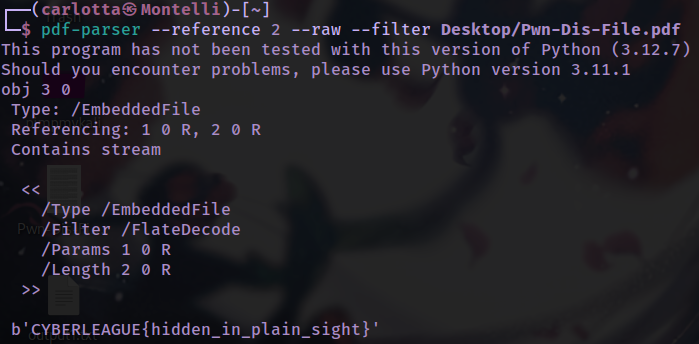

Since this is a .pdf file, I will use Didier Steven's PDF tools for forensics purposes. Firstly, use **pdfid** or **pdf-parser -a** to get some data on the file.

​​

​​

Shown above, we have /EmbeddedFile which is very suspicious/interesting! Let's check that out (Notice how pdf-parser -a outputs it as  **/EmbeddedFile 1: 3**, 3 likely being the object number)

​​

```
# Outputs the entire file in raw data, search for embeddedfile manually
pdf-parser --raw Desktop/Pwn-Dis-File.pdf

pdf-parser --object 3 --raw Pwn-Dis-File.pdf
```

​​

From this we can see that indirect object 3 is referencing 1 and 2. Hence, let's check out the object being referenced!

```
pdf-parser --reference 2 --raw Desktop/Pwn-Dis-File.pdf
```

​​

Notice  **/Filter /FlateDecode** which indicates that the data has been compressed into a zlibstream. Hence, we will use  **--filter** to get the original contents

```
pdf-parser --reference 2 --raw --filter Desktop/Pwn-Dis-File.pdf
```

​​

PS: Use additional tools such as **strings** and **exiftool** to get more information about the pdf file. This writeup is a condensed, streamlined walkthrough which omitted all the errors and unfruitful research I went through. Always enumerate and search online for tools and tricks you can use as well when solving such challenges!

```
pdf-parser --raw Desktop/Pwn-Dis-File.pdf | grep -a '.\{5,10\}' | head -n 100
```

​​

Credits: Didier Stevens
* https://www.youtube.com/watch?v=F3rpZT0gKXw&list=PLa-ohdLO29_Y2FeT24w-c9nA_AH84MIpp
* https://youtu.be/tHVi2wKCkTc

References:
1. https://blog.didierstevens.com/programs/pdf-tools/
2. https://blog.didierstevens.com/2008/10/20/analyzing-a-malicious-pdf-file/
3. https://stackoverflow.com/questions/69555654/identifying-compression-method-in-pdf-and-flatedecode
4. https://community.metaspike.com/t/best-tool-for-pdf-forensics/1090
5. https://askubuntu.com/questions/150100/extracting-embedded-images-from-a-pdf

Minor References

1. https://unix.stackexchange.com/questions/184519/how-to-grep-for-line-length-in-a-given-range
2. https://unix.stackexchange.com/questions/335716/grep-returns-binary-file-standard-input-matches-when-trying-to-find-a-string
