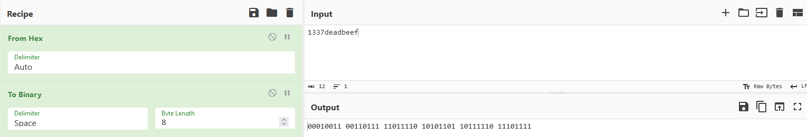
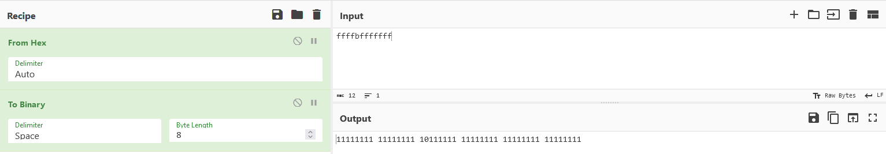
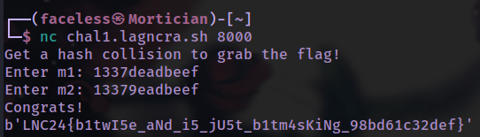

# Bit collider

```python
# app.py
from Crypto.Util.number import bytes_to_long
from secret import flag

def hash(x):
    return (bytes_to_long(x) ^ 0x1337deadbeef) & 0xffffbfffffff

print("Get a hash collision to grab the flag!")
m1 = bytes.fromhex(input(f"Enter m1: "))[:6]
m2 = bytes.fromhex(input(f"Enter m2: "))[:6]

h1 = hash(m1)
h2 = hash(m2)
if m1 != m2 and h1 == h2:
    print("Congrats!")
    print(flag)
```

Firstly, the code converts one's hexadecimal input into bytes, and only takes the first 6 bytes. The hash(x) function then:

1. m1 XOR 0x1337deadbeef
2. m1 AND 0xffffbfffffff
3. m2 XOR 0x1337deadbeef
4. m2 AND 0xffffbfffffff

Afterwards, it checks if h1 is equal to h2. Hence, let's look at what 0x1337deadbeef and 0xffffbfffffff looks like in binary.

​​

​​

1337deadbeef:  
0001 0011 0011 0111 1101 1110 1010 1101 1011 1110 1110 1111

ffffbfffffff:  
1111 1111 1111 1111 1011 1111 1111 1111 1111 1111 1111 1111

Now, **lets assume our first input** is 1337deadbeef. <u>Results will be underlined</u>:

1337de XOR 1337deadbeef:

0001 0011 0011 0111 1101 1110  
0001 0011 0011 0111 1101 1110  
<u>0000 0000 0000 0000 0000 0000</u> 

AND ffffbfffffff:  
0000 0000 0000 0000 0000 0000  
1111 1111 1111 1111 1011 1111  
<u>0000 0000 0000 0000 0000 0000</u>

Notice for the *AND 0xffffbfffffff*  operation, every bit is 1 except for one bit being 0. Since that bit is 0, the  **AND operation** will always result to 0 no matter what. Hence, that bit is what we should be tampering with.

* That bit is the second bit from the 5th byte
* Our 5th byte after the XOR Operation **must be** 0100 or 0000

Hence. the 5th byte we provide as input will be either 1001 or 1101.

* 1001 XOR 1101 = 0100
* 1101 XOR 1101 = 0000

since 1101 = d (from binary to hexa), our only option is **1001 which is 9** (from hex to binary)

Therefore, our first input would be 1337de and our second input would be 13379e, successfully providing us the flag!

​​

Flag: b'LNC24{b1twI5e_aNd_i5_jU5t_b1tm4sKiNg_98bd61c32def}'

‍

References:

https://github.com/gchq/CyberChef/issues/1029
