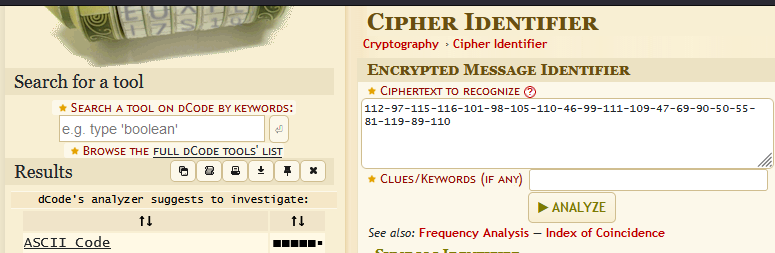
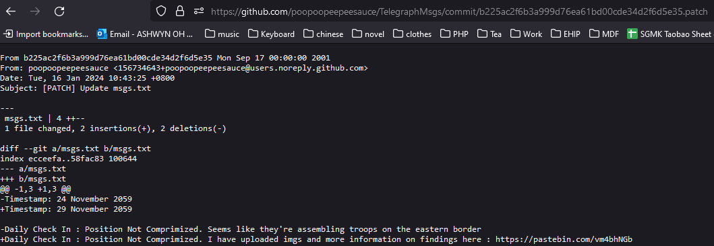

# Boblox

Navigate over to the creator of the Roblox Game, @LNC4RobloxDevSpy. Under the 'About' account description contains an ASCII-encoded text which when decoded provides us a pastebin link.

​​

​​

​​

pastebin.com/EZ27QwYn. This link gives us further context and information. It states that the nuclear launch codes are hidden in 3 roblox accounts, with redacted account IDs starting with 544787XXXX and the 'About' description of the roblox accounts starting with LagNCrash.

​​

Hence, I created a python script to brute force the desired account IDs. As shown below, one of the three account IDs is 5447870123. Upon visiting the account's profile, I realised the name of the account is 'LNC4RBXACC1' which may be a acronym for 'LagNCrash Roblox Account 1'.

```python
import requests

for a in range(1, 10000):
	bruteID = '544787' + format(a, "04")
	URI = 'https://www.roblox.com/users/' + bruteID + '/profile'
	x = requests.get(URI)
	print('Trying: ' + format(a, "04"))
	if('LagNCrash' in x.text):
		print('Account Found!')
		print(bruteID)
		print(URI)
		print('----------')
```

​​

​​

Since the account name starts with LNC4RBXACC, I searched for other accounts starting with LNC4RBXACC, and managed to find the other 2 accounts this way!

​​

​​

​​

Looking at the account description, the string seems to be in binary. Converting it using CyberChef, the 3 strings combined provides a link to a github account named 'poopoopeepeesauce'.  
https://github.com/poopoopeepeesauce/

​​

Opening the link, we can see that the account has three repositories. After looking at all 3 repositories, I decided to look at the **commit history,**  eventually finding another pastebin link from the 'TelegraphMsgs' repository's second commit.  
https://pastebin.com/vm4bhNGb​

​​

​​

Opening the pastebin link, we are provided with another message. The message contains the first half of the flag, as well as a link to a website made with Wix.  
https://soraalt2.wixsite.com/mysecretwebsite

​​

Exploring the website, the footer contains the message 'Send me an email 4 Flag: <REDACTED>'. In the 'about' section, there contains invisible text with 'Hint: Look at email'.

​​

​​

Hence, I went back to the github account to find it's email. Searching online, I found a trick to find Github User Emails via commits made to the repository.

1. Navigate into a commit made.
2. In the URL, add .patch to the end of the URL

​​

However, the email above *poopoopeepeesauce@users.noreply.github.com* is a noreply email which means that I had went out-of-scope.

After brainstorming for a while, I realised the second pastebin message had the Timestamp of **16th January 2024**. However, the first pastebin message had timestamps in the year **2059**.

Hence, I inferred that 16th January may be an important clue, and utilised **Wayback Machine** to possibly view an archive of the website on that date. Viewing the snapshot, I was able to find the desired email, *4hsarcngal@gmail.com*

​​

​​

I then sent an email to the address, and received a reply containing an ID for discord. Using discordlookup.com, the ID seemed to be a Guild ID for a discord server. Lastly, I joined the discord server and found the flag!

​​

​​

​​

Flag: LNC24{In54n3_051nt_Ch4ll3ng3}

‍

References:

https://wizardsourcer.com/simple-way-to-find-github-user-emails/

https://web.archive.org/web/20240116111249/https://soraalt2.wixsite.com/mysecretwebsite

https://discordlookup.com/guild/1197367899883589703

‍
