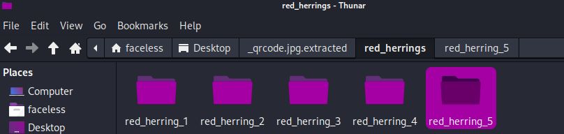
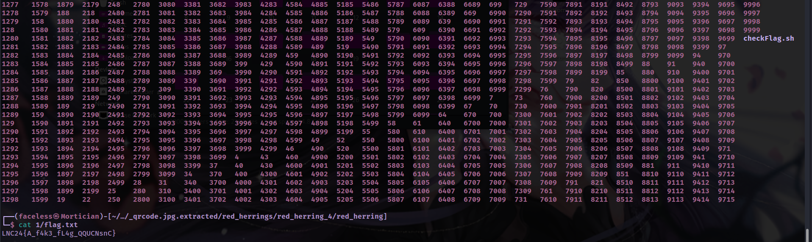
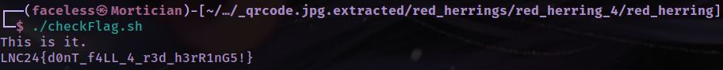

# The Elusive Red Herring

Upon inspecting the file using exiftool, I realised the image was 2MB large. Hence I used binwalk to extract any hidden files.

```python
binwalk -e qrcode.jpg
```

Embedded into the image was a zip file which when unzipped, contained five different folders named red_herring_1 all the way to red_herring_5. 

​​

Every directory except for red_herring_4 contained images which had nothing of interest. red_herring_4 contained red_herring.zip which when unzipped, created 9999 directories. Each of these directories contained flag.txt which contained a fake flag, except for one.

​​

Hence, I created a bash script to:

1. cd into each of the 9999 directories
2. cat flag.txt
3. check if the substring ''LNC24{A_f4k3" **is not** present. If it isn't present, print out the flag (most likely correct flag)

```bash
#! /bin/bash

for i in $(seq 1 10000); do
    cd "/home/faceless/Desktop/_qrcode.jpg.extracted/red_herrings/red_herring_4/red_herring/$i"
    checkFlag=$(cat flag.txt)
    if [[ "$checkFlag" != *"LNC24{A_f4k3"* ]]; then
        echo "This is it."
		echo $checkFlag
    fi
done
```

With the script above, I managed to find the flag: LNC24{d0nT_f4LL_4_r3d_h3rR1nG5!}

​​

‍
