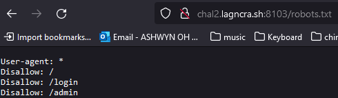
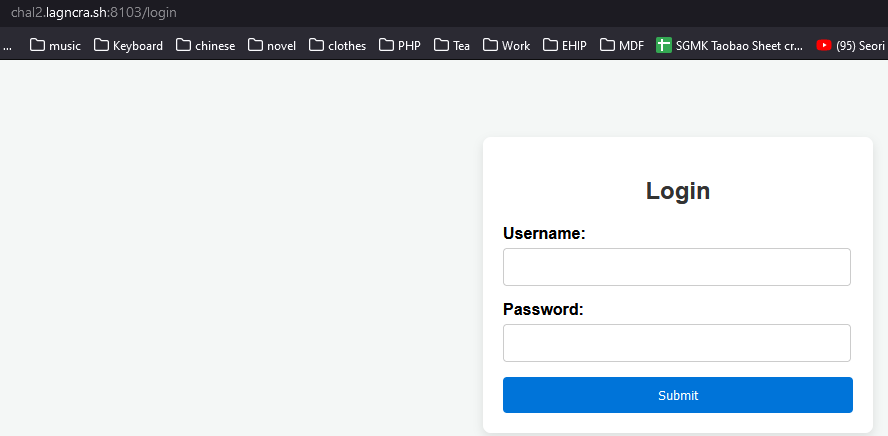
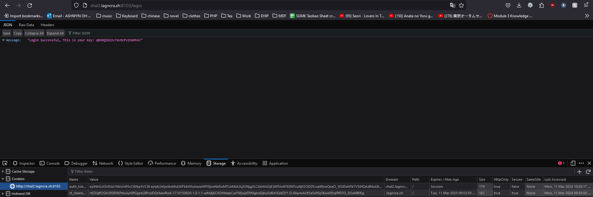
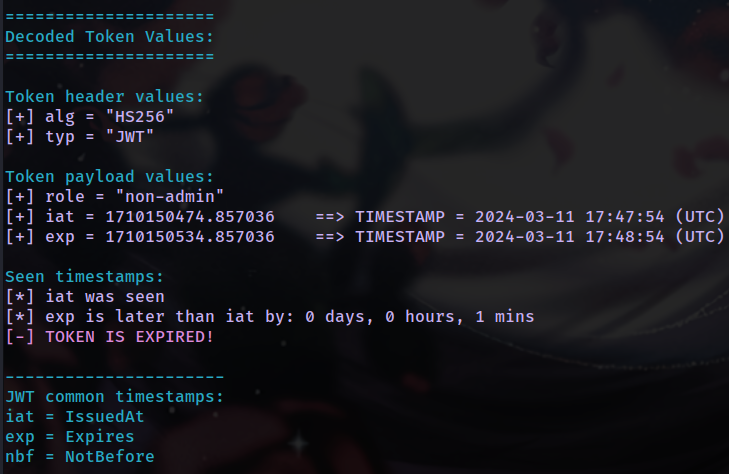
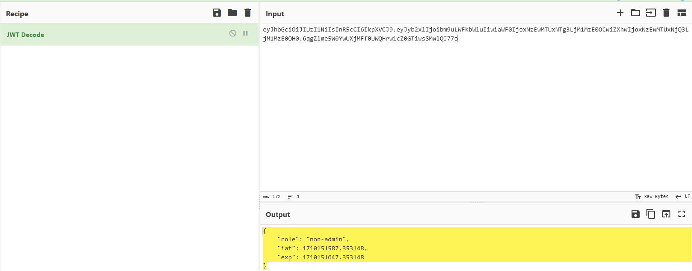
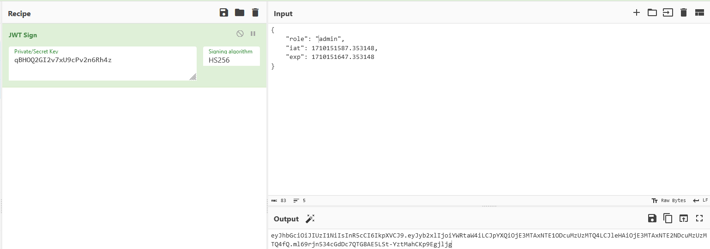
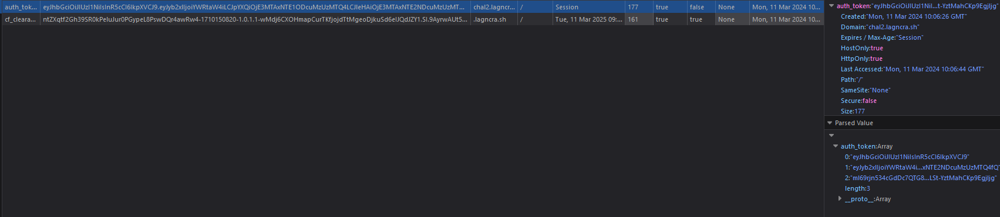
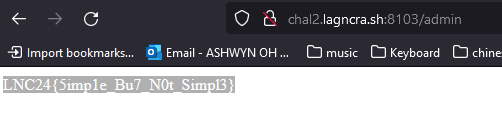

# This_WEB_Too_Simple

app.py

```
from flask import Flask, request, g
import sqlite3

app = Flask(__name__)

@app.route('/login', methods=['GET', 'POST'])
def login():
    if request.method == 'POST':
        username = request.form['username']
        password = request.form['password']

        query = f"SELECT * FROM users WHERE username = '{username}' AND password = '{password}'"
        cur = get_db().cursor()
        cur.execute(query)
        result = cur.fetchone()
      

def get_db():
    db = getattr(g, '_database', None)
    if db is None:
        db = g._database = sqlite3.connect(DATABASE)
    return db


@app.teardown_appcontext
def close_connection(exception):
    db = getattr(g, '_database', None)
    if db is not None:
        db.close()


DATABASE = './database.db'
```

/robots.txt

​​

/login

​​​​

As there is no input validation for the SQL query, the query is susceptible to **SQL Injection**. After multiple injections, I was able to deduce the following:

1. Upon authentication bypass via SQLi, we will be provided with a JWT token, *auth_token*, and a key (private key used to sign the JWT token.)
2. We are only able to login as 'user' (attempts to inject as admin, root, administrator, superuser, etc. will lead to incorrect credentials)

```
' OR 1=1-- -
user'-- -
```

​​

From analysing the JWT Token, we can deduce:

1. Our token's "role" parameter is set to 'non-admin'
2. The token expires in 1 minute.

​​

*Figure 1.1:  jwt_tool.py*

Hence, to get the flag, we will have to:

1. Decode the JWT token (I used Cyberchef's JWT Decode)
2. Resign the JWT token using the private key provided to us

    1. Edit the "role" parameter to "admin" instead of "non-admin"
    2. Signing algorithm: HS256  
        Private/Secret Key: <>
3. Replace the value of the *auth_token* cookie with our signed JWT Token
4. Navigate to /admin
5. Complete steps 1-4 in **under one minute** (important!)

​​

​​

​​

‍

If all 5 steps were done properly, navigating to /admin will present us with the flag!  
*LNC24{5imp1e_Bu7_N0t_Simpl3}*

​​

‍

References:

https://jwt.io/introduction

https://github.com/ticarpi/jwt_tool

‍
